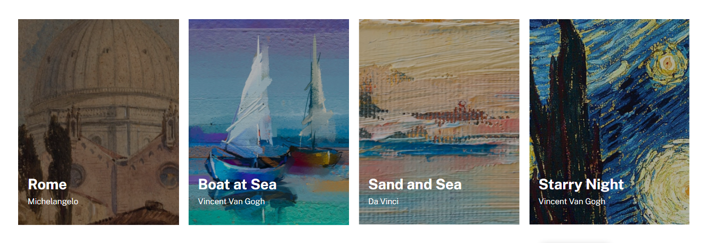
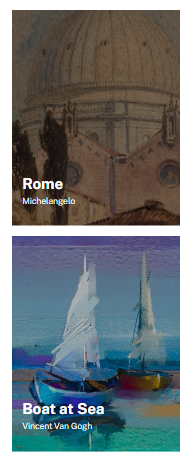

# Lista de Imagens / Pinturas
Trata-se de uma suposta de lista de imagens (pinturas) dispostas feitas com display flexbox! 🚀

[](https://google.com)

[](https://google.com)

## Tecnologias Utilizadas
- HTML
- CSS

## Como Utilizar

1 - Clone o projeto
```
git clone <url>
```

2 - Acesse a pasta do projeto

```
cd 07-lista-de-imagens
```